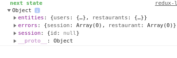
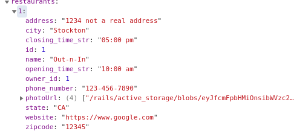
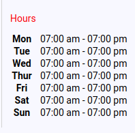
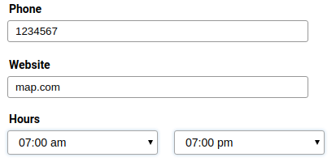

# Welp, a Yelp Clone

## Link to the site: [Welp](https://aa-welp.herokuapp.com/#/ "Welp")

A Yelp clone which allows users of the site to advertise their restaurant.  The site uses Rails as a backend to return JSON data and a static page with react-redux for quick loading times.

---

## Features

* User Authentication
* Restaurant Creation

---

## Technologies

* Rails 5.2.3 - used as the backend to return data
* Ruby 2.5 - ruby on rails
* react-redux - front-end routing, components, and setting up backend data for frontend usage
* webpack - javascript gets very messy with the amount of files you can have
* ajax - asynchronous javascript
* postgreSQL - the db of choice

---

## User Authentication

User authentication which uses rails as a backend to manage sessions.  Passwords are encrypted using BCrypt and salted before being stored into the database.  Many of the issues I ran into while finishing user_auth had to do with signup/signin errors and setup.  

Setting up all the actions and reducers, writing the correct ajax requests to the backend,passing the data through the state, and retrieving the data from the state into your frontend is a pretty daunting tasks and many hiccups are sure to plague you setting it up.  Great use of debuggers and paying attention to the state of your application will help you in grabbing the correct data when mapping state to props.



```javascript
const restaurant = state.entities.restaurant[ownProps.match.params.restaurantId]
```

is different than

```javascript
const restaurant = state.restaurant[ownProps.match.params.restaurantId]
```

It turns out it's also important for you backend to return status code for errors when it has them, otherwise redux determines the returned JSON as a successful callback.

```ruby
if @user
        login(@user)
        render 'api/users/show'
    else
        render json: ['invalid creds'], status: 400
    end
```

If the status code wasn't passed along with it, redux would determine this as a successful callback and incorrectly store the results in the incorrect portion of the state.  

Errors persisting when switching pages was an issue, but it was an easy fix by adding the correct errors action and using the correct React lifecycle method to call it.

---

## Restaurant CRUD

The creations of restaurants and the ability to create, show, edit, and update as need is the most important feature of cloning Yelp, it's what Yelp itself does!  Welp itself has basic CRUD functionality for restaurants, although not quite as in-depth as Yelp itself.  User can create a restaurant, edit any existing restaurant, and if the current user is the owner of the restaurant, has the option to remove it from the Welp with the click of a button.

One of the biggest issues for me here was parsing the hours portion of my restaurant model to grab only the relevant part of it (the hours and minutes), as well as translating army time into general time.  StackOverflow came through and gave a very clean way to display the correct information I needed:

```ruby
def opening_time_str
        self.opening_time.strftime("%I:%M %P")
    end

    def closing_time_str
        self.closing_time.strftime("%I:%M %P")
    end
```

You can't give the method call the same name as the column you want in jbuilder so you have to change it a bit. JBuilder passes down the hours information using the same name as the method call rather than the column name itself.



This creates an issues however when you want to edit a restaurant and you want to pre-fill all the relevant information to avoid having your user re-enter in all that information. Since the column opening_time and closing_time column aren't stored with those name, the hours selector of the forms will always default to the top value.  My solution to this was simply adding the proper columns into the state by giving it the value of the method call like so when mapping state to props:

```ruby
const rest = state.entities.restaurants[ownProps.match.params.restaurantId];

    if (rest) {
        rest["opening_time"] = rest.opening_time_str
        rest["closing_time"] = rest.closing_time_str
    }
    return {
        restaurant: rest,
        formtype: "Edit",
        errors: state.errors.restaurant
    }
```



Now when the user chooses to edit the page, the hours come pre-selected.  



Making sure all the select options came prefilled was an issues for a bit, but making sure the value being pass in matches exactly what's in the options values fixed that issues.

Because my form allowed users to add photos when creating a restaurant, it required the data to be passed in a different format, rather than simply passing in the state like usual.  The documentation I read required you to make use of formData, which requires significantly more set-up to pass in to you ajax call in comparison to a non formData call.

```javascript
handleSubmit(e){
        e.preventDefault()
        const formData = new FormData();

        Object.keys(this.state).forEach(key => {
            if (key === 'photos') {
                for (let i = 0; i < this.state.photos.length; i++){
                    formData.append('restaurant[photos][]', this.state.photos[i])
                }
            } else {
                formData.append(`restaurant[${key}]`, this.state[key])
            }
        })
        if(this.props.formtype === 'Edit'){
            this.props.processData(formData, this.props.restaurant.id)
            .then( restaurant=> {
                 
                 this.props.history.push(`/restaurants/${restaurant.restaurant.id}`)
            })
        } else {
            this.props.processData(formData)
            .then( restaurant=> {                
                 this.props.history.push(`/restaurants/${restaurant.restaurant.id}`)
            })
        }
    }
```

compared to

```javascript
handleSubmit(e){
        e.preventDefault()
        this.props.processForm(this.state)
    }
```

oof

---

### General Problems

General issues were mostly related to styling (which feels like 80% trial and error) and syntax error.  I also had to make changes to the backend like adding and removing columns.  Having a second pair of eyes helps significantly in debugging, and having past projects and documentations to reference is also a huge boon.